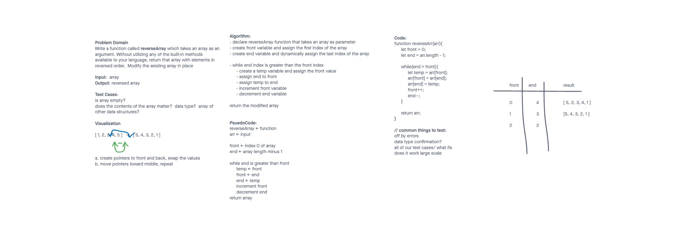

# Data Structures - Arrays

> 🏡 **[**Home**](../../README.md)**

---

## 1️⃣ Array - Reverse

## Feature Tasks

Write a function called `reverseArray` which takes in an array as an argument, and returns an array with elements in reversed order.

---

### Example

| Input | Output |
|-------|--------|
| [1, 2, 3, 4, 5, 6] | [6, 5, 4, 3, 2, 1] |

---

### Solution

---

### Structure and Testing

Utilize the Single-responsibility principle: any methods you write should be clean, reusable, abstract component parts to the whole challenge.

You will be given feedback and marked down if you attempt to define a large, complex algorithm in one function definition.

---

### Stretch Goal

Once you’ve achieved a working solution, implement the same feature with a different methodology.

(Hint: what different techniques do you have when working with arrays? Recursion, loops, indexes, modifying the array input directly…)

In other words, use a different algorithm & pseudocode to solve the same problem. Then compare approaches for efficiency, readability, flexibility, etc.

---

## 2️⃣ Array - Insert Shift

---
